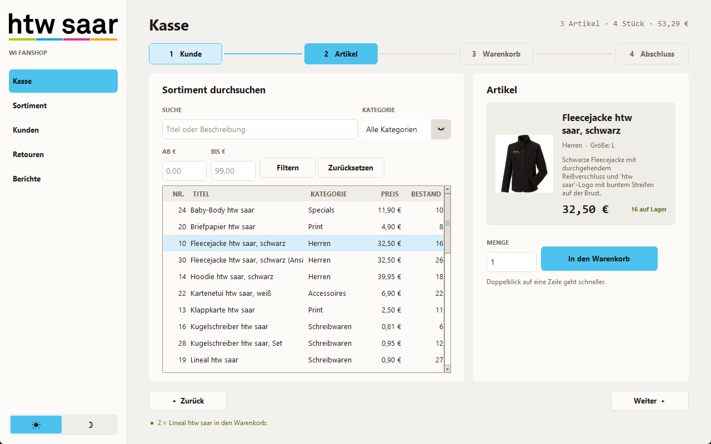
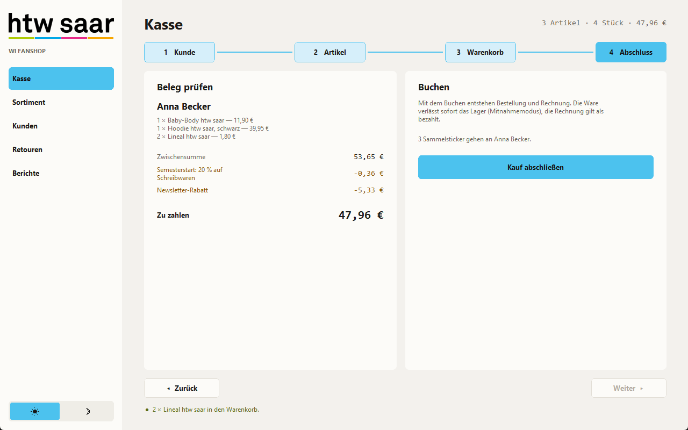

# WI Fanshop — Kassensystem und Warenwirtschaft

Desktop-Kassensystem für den Verkaufsstand „WI Fanshop" der htw saar.
Softwareprojekt **WINF-B25-450**, Sommersemester 2026, **Gruppe 10**.

Die Anwendung bildet den Verkauf am Point of Sale ab: Artikel suchen, Warenkorb
zusammenstellen, Rabatte berechnen, kassieren, Sticker ausgeben, Retouren
annehmen und der Shop-Leitung Berichte liefern. Sie läuft vollständig lokal,
ohne Internet und ohne Server.



---

## Technische Eckdaten

| | |
|---|---|
| **Sprache** | Python 3.14 (objektorientiert) |
| **Oberfläche** | CustomTkinter 5.2+ |
| **Datenbank** | SQLite (eine lokale Datei `fanshop.db`) |
| **Diagramme** | matplotlib (optional, nur für die Kann-Kriterien) |
| **Tests** | `unittest` aus der Standardbibliothek — 177 Tests |
| **Betriebssysteme** | Windows, macOS, Linux |
| **Fenstergröße** | mindestens 1280 × 800 |
| **Umfang** | rund 8.000 Zeilen Python in 50 Dateien |
| **Externe Dienste** | keine — die Anwendung ist Offline-First |

---

## Quickstart

**Voraussetzung:** Python 3.11 oder neuer (entwickelt mit 3.14).
Prüfen mit `python --version`.

```bash
git clone <repository-url>
cd SoftwareprojektSoSe26
pip install -r requirements.txt
python main.py
```

Das war alles. Beim ersten Start passiert automatisch:

1. Die Datenbank `fanshop.db` wird im Projektverzeichnis angelegt.
2. Alle Tabellen werden erzeugt.
3. Testdaten werden eingespielt: 31 Artikel mit echten Produktfotos und den
   Preisen des htw-saar-Webshops — jeder Artikel genau einmal, die sechs
   Textilien je einmal für Damen und für Herren. Dazu 5 Kunden,
   2 Sonderaktionen und 9 Beispielbestellungen der letzten Wochen — samt
   gefüllten Sticker-Alben. Eine Kundin hat bereits drei Einkäufe, also die
   volle Sammlung und das Starterset.

Bei jedem weiteren Start wird nichts überschrieben — die Anwendung startet mit
den vorhandenen Daten.

### Zugang wählen

Vor dem Öffnen der Anwendung wird die Zugangsart ausgewählt:

- **Kunde**: kann ausschließlich die Seite **Kasse** nutzen.
- **Kassierer**: hat Zugriff auf alle Bereiche der Anwendung.

### Von vorne anfangen

Datenbankdatei löschen und neu starten:

```bash
python main.py
```

(vorher `fanshop.db` löschen — die Datei liegt im Projektverzeichnis)

### Tests ausführen

```bash
python -m unittest discover -s tests -t . -v
```

---

## Die fünf Fachseiten

| Seite | Wofür | Anforderungen |
|---|---|---|
| **Kasse** | Geführte Strecke in vier Schritten bis zum gebuchten Kauf | /F11/–/F14/, /F52/, /F53/ |
| **Sortiment** | Artikel anlegen, pflegen, deaktivieren, durchsuchen, Produktfoto zuweisen, Sonderaktionen schalten | /F21/–/F23/ |
| **Kunden** | Kartei, Suche, Newsletter-Anmeldung, Sammelalbum, Starterset-Stand | /F41/–/F44/, /F52/, /F53/ |
| **Retouren** | Bestellung suchen, Ware zurücknehmen, Erstattung | /F51/ |
| **Berichte** | Kennzahlen je Zeitraum, Ranglisten, Diagramme | /F31/–/F313/, /F24/–/F27/ |

Nach der Zugangsart richtet sich, welche dieser Seiten aufgebaut werden:
**Kunde** sieht nur die Kasse, **Kassierer** die vollständige Navigation.
Ganz unten in der Navigation liegt auch der Schalter zwischen Hell- und
Dunkelmodus (/F54/).

---

## Ein typischer Verkauf

Die Kasse führt durch vier Schritte — oben sieht man immer, wo man steht, unten
geht es mit **Zurück** und **Weiter**:

**1. Kunde** — in der Liste suchen und anklicken, oder „Ohne Kundenkonto verkaufen".
Rechts stehen Anschrift, Sammelstand („4 von 6 Sammelstickern") und ein offener
Newsletter-Gutschein.

**2. Artikel** — über Suchfeld, Kategorie oder Preisspanne finden. Die markierte
Zeile zeigt rechts das Produktfoto mit Preis und Bestand. Menge eintragen, bei
Kleidung die **Größe** aus der Liste wählen, **In den Warenkorb** — oder
Doppelklick auf die Zeile.

Die Größenliste füllt sich passend zum markierten Artikel: Damen S–XL, Herren
S–5XL. Bei allem, was keine Größe hat, bleibt das Feld gesperrt.

Oben in der Strecke sieht man jederzeit, wo man steht; anklicken springt zurück
und, wenn schon Ware im Korb liegt, auch vorwärts.

**3. Warenkorb** — Mengen ändern, Positionen entfernen. Jede Zeile führt ihre
Größe mit; derselbe Pullover in M und in L sind zwei getrennte Zeilen. Rechts
steht jede Rabattzeile einzeln: Artikelrabatt, laufende Sonderaktion,
Newsletter-Gutschein.

**4. Abschluss** — der fertige Beleg mit Endbetrag. **Kauf abschließen** bucht
Bestellung und Rechnung, zieht den Lagerbestand ab und zeigt die zwei
Sammelsticker, die der Kunde bekommt. Ist die Sammlung damit vollständig, liegt
das **Starterset** bei (siehe unten).



---

## Sortiment und Größen

**Jeder Artikel kommt genau einmal vor.** Früher stand dasselbe Produkt mehrfach
im Katalog, weil jede Größe eine eigene Zeile brauchte (die Fleecejacke etwa
zweimal, in M und L, und nur bei Herren). Das ist aufgeräumt: Ein Kleidungsstück
ist **ein** Artikel, und die Größe wird beim Bestellen gewählt.

**Damen und Herren führen dasselbe Sortiment.** Beide Kategorien haben dieselben
sechs Textilien — T-Shirt, Poloshirt, Hoodie, Fleecejacke, Sport-Shirt und
Regenbogen-Shirt. Unterschiedlich ist nur die Größenspanne:

| Kategorie | Größen |
|---|---|
| **Damen** | S · M · L · XL |
| **Herren** | S · M · L · XL · XXL · 3XL · 4XL · 5XL |
| alle übrigen Kategorien | keine Größe |

Die Spannen stehen an einer einzigen Stelle — `GROESSEN_JE_KATEGORIE` in
[fanshop/konfiguration.py](fanshop/konfiguration.py). Wer eine Größe ergänzen
will, ändert nur dort.

**Wo die Größe auftaucht:**

- **Kasse, Schritt 2** — Auswahlliste neben der Menge, gefüllt passend zum
  markierten Artikel. Ohne Größe kein Kleidungsstück im Korb.
- **Kasse, Schritt 3** — eigene Spalte im Warenkorb. Derselbe Artikel in zwei
  Größen sind zwei Zeilen, die sich getrennt ändern und entfernen lassen.
- **Bestellung** — die gewählte Größe steht auf der Bestellposition und damit
  auf dem Beleg.
- **Retouren** — zurückgegeben wird eine **Position**, nicht ein Artikel. Wer
  den Hoodie in L zurückbringt, lässt den in M unberührt.
- **Sortiment** — die Maske zeigt die Spanne der Kategorie an. Sie ist keine
  Eingabe: Sie gilt für alle Artikel dieser Kategorie.

**Lagerbestand zählt je Artikel, nicht je Größe.** 10 Hoodies auf Lager heißt
10 insgesamt — der Verkaufsstand führt kein Größenlager.

---

## Sammelsticker und Starterset (/F53/)

Zu jedem abgeschlossenen Einkauf gibt es Sammelsticker aufs Kundenkonto — und
wer die Sammlung vollmacht, bekommt das Starterset gratis dazu.

### Die Sticker

| Regel | |
|---|---|
| **Motive** | sechs Stück: Campus Rotenbühl · Waren Sie schon an der htw saar? · Kneipentour · Wer liebt, der schiebt · Erstmal mensen · Vier gewinnt |
| **Pro Einkauf** | **2 Sticker** |
| **Reihenfolge** | fest, nicht zufällig — der Reihe nach durch die Motivliste |
| **Doppelte** | ausgeschlossen: **jedes Motiv wird nur ein einziges Mal vergeben** |
| **Obergrenze** | 6 Sticker je Kunde. Wer alle hat, bekommt keine weiteren mehr |
| **Mindestbestellwert** | **keiner** — jeder Kauf zählt, unabhängig vom Betrag |
| **Laufkundschaft** | geht leer aus — ohne Kundenkonto gibt es nichts gutzuschreiben |

Sechs Motive geteilt durch zwei pro Kauf: Nach **drei Einkäufen** ist die
Sammlung voll. Die feste Reihenfolge ist Absicht — sie macht das Verhalten
wiederholbar und damit testbar, und niemand zieht fünfmal dasselbe Bild.

In der Kundenkartei stehen alle sechs Motive nebeneinander: die vorhandenen in
Farbe, die fehlenden blass. So sieht man auf einen Blick, was noch fehlt.

### Das Starterset — das Sonderangebot

Wer **drei Einkäufe** getätigt und damit **alle sechs Motive** beisammen hat,
bekommt **einmalig** ein Set aus **Stift, Block und Jutebeutel** gratis. Es wird
dem Kundenkonto gutgeschrieben und der Bestellung beigelegt — die Kasse blendet
beim Buchen den Hinweis ein, dass das Set mit über den Tresen geht.

| Bedingung | |
|---|---|
| **Einkäufe** | mindestens 3 |
| **Sammlung** | vollständig (alle 6 Motive) |
| **Häufigkeit** | **einmal je Kunde** — nicht einmal je Bestellung |
| **Mindestbestellwert** | **keiner** — es zählt allein die Zahl der Einkäufe |

Das Starterset ist bewusst **keine** schaltbare `Sonderaktion`: Eine
Sonderaktion ist ein Rabattsatz, von dem immer nur einer gleichzeitig laufen
darf. Das Starterset senkt keinen Preis, sondern legt eine Sachprämie bei, und
es soll durchgehend gelten — auch während gerade „20 % auf Schreibwaren" läuft.
Deshalb steht es als **dauerhaftes Sonderangebot** unter der
Sonderaktionstabelle im Sortiment und läuft automatisch mit.

Details und Begründungen: [specs/09-sticker.md](specs/09-sticker.md).

---

## Projektstruktur

```
SoftwareprojektSoSe26/
├── main.py                  Startpunkt
├── DESIGN.md                Designsystem (Farben, Schriften, Regeln)
├── requirements.txt
├── fanshop/
│   ├── konfiguration.py     Pfade, Kategorien, Rabattsätze
│   ├── fehler.py            eigene Fehlerklassen
│   ├── hilfsmittel.py       Formatierung, Datum, Zahlen
│   ├── zugriff.py           erlaubte Seiten je Zugangsart
│   ├── datenbank/           SQLite-Verbindung, Schema, Testdaten
│   ├── modelle/             Fachklassen (Artikel, Kunde, Warenkorb …)
│   ├── repositories/        Datenzugriff — der einzige Ort mit SQL
│   ├── logik/               Geschäftslogik (Kasse, Retouren, Berichte)
│   └── gui/                 Oberfläche (CustomTkinter)
├── tests/                   177 automatische Tests
├── specs/                   ein Kurzsteckbrief je Baustein
├── docs/                    Dokumentation (siehe unten)
└── assets/                  Produktfotos, Sticker, htw-saar-Logos
```

---

## Dokumentation

| Datei | Inhalt |
|---|---|
| [docs/Architektur.md](docs/Architektur.md) | Schichten, Entwurfsentscheidungen, Datenmodell, Abweichungen vom Pflichtenheft |
| [docs/Technische-Dokumentation.md](docs/Technische-Dokumentation.md) | Was steckt wo — Datei für Datei, jede Anforderung mit Fundstelle |
| [DESIGN.md](DESIGN.md) | Designsystem: Farben der htw saar, Schriften, Gestaltungsregeln |
| [docs/Commit-Plan.md](docs/Commit-Plan.md) | In welcher Reihenfolge das Projekt ins Repository kommt |
| [specs/09-sticker.md](specs/09-sticker.md) | Sammelalbum und Starterset: sechs Motive, zwei pro Kauf |
| [specs/](specs/) | Kurzsteckbriefe der einzelnen Bausteine |

---

## Aufbau in vier Schichten

```
GUI  →  Logik (Services)  →  Repositories  →  Datenbank
```

Jede Schicht kennt nur die Schicht unter sich. Die Oberfläche enthält keine
Rechnung und kein SQL; die Geschäftslogik läuft vollständig ohne Fenster —
genau das machen die 177 Tests. Details in
[docs/Architektur.md](docs/Architektur.md).

---

## Bekannte Grenzen

Bewusst nicht umgesetzt (so im Pflichtenheft, Kapitel 1.3, festgelegt):

- kein Online-Shop, keine Weboberfläche, keine Netzwerkfunktion
- kein Zahlungsdienstleister — die Rechnung gilt ab Kauf als bezahlt
- kein Versand, nur Mitnahmemodus
- kein Mehrbenutzerbetrieb, keine Benutzeranmeldung
- ein aktiver Kunde pro Vorgang
- keine Anmeldung: Die Zugangsart begrenzt die sichtbaren Bereiche, ist aber
  kein passwortgeschütztes Berechtigungssystem

---

## Team

Gruppe 10: Lukas Ley, Tim Daniel, Sebastian Uli Froschauer, Emir Impis Sali,
Michail Iliev.

Betreuung: Prof. Dr. Daniel F. Abawi, Michael B. Schmidt —
Fakultät für Wirtschaftswissenschaften, htw saar.
